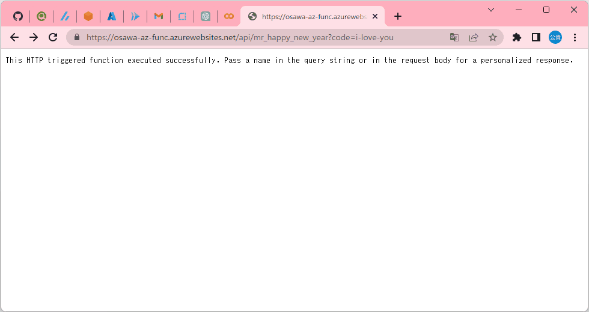

# learning-azure-func

🚀🚀🚀 Azure Functionsを学習する。  
SaaSは簡単でイイネ！  

  

## 手順 (自分用メモ)

`ms-azuretools.vscode-azurefunctions`拡張機能をインストール。  
その拡張機能のタブを開いてAzureにログイン。  

WORKSPACEから新規関数を作成する。  
雲のデプロイマークからデプロイ可能。  

🐧🐧🐧 非常に簡単 🐧🐧🐧  

トークンは関数を選択し、関数キーから管理可能。  
